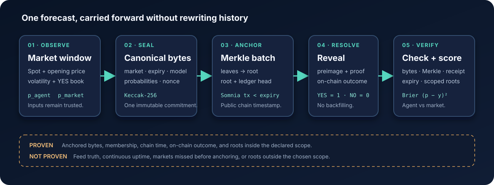

<p align="center">
  
</p>

# ProofEdge

ProofEdge is not a probability formula. It is infrastructure that makes
after-the-fact changes to a forecasting record publicly detectable. I publish
the loss because the point is not to manufacture a win; it is to show that the
recorded forecasts still verify after the outcomes are known.

<!-- The blocks between generated markers are rewritten from
     dashboard/app/forecast-data.json by scripts/render-readme-stats.ts on
     every publisher run. Edit the surrounding prose, not these numbers. -->
<!-- generated:hook -->
My estimator's Brier loss was 26.8% worse than the market's. I know
because every probability in that result was committed before the answer
existed; changing the disclosed bytes now would break verification against
the earlier anchor.
<!-- /generated:hook -->

Here, a forecast is one sealed probability, an anchor is one Merkle-root
transaction, a disclosed root is a unique on-chain root accounted for by the
published ledger, and a proof is one disclosed forecast checked against its
root. `N` is the resolved sample size; negative Brier skill means the estimator
lost to the market midpoint.

<!-- generated:headline -->
**4199 forecasts · 1812 disclosed roots · 4182 public proofs · 0 undisclosed
production roots · Brier skill −0.268 across 7 model versions at N=4188.** The
skill figure is the mixed historical total, not the result of the current model
version; its two samples are reported separately below.
11 newer forecasts were still waiting for resolution in the published snapshot.
6 forecasts have no full evidence body or individual public proof file.
Resolved forecasts in that group still enter the ledger-derived score and
calibration.
None was unanchored or anchored late
(`dashboard/app/forecast-data.json`, keys `totals`, `resolve_score` and
`completeness`).
<!-- /generated:headline -->

## For judges

Three doors onto the same sealed bytes: a browser check, a clean-clone CLI
check, and a whole-record audit. Each can fail in public.

1. **One forecast, in the browser, with no local toolchain.**
   The dashboard's § 4 panel runs the same five checks against public Somnia
   JSON-RPC and returns one of the same three verdicts. It needs no key, no
   toolchain and no evidence file of your own: it ships the forecasts it
   verifies, and it prints its own elapsed time. The check took about 20 seconds
   when measured on 2026-09-01. Open <https://proof-edge.pages.dev>, scroll to
   § 4 and press VERIFY THIS FORECAST (`dashboard/app/verify-panel.tsx:82-159`).
   The deployed page is a static export whose figures are frozen at the moment
   it was exported; this README is re-rendered every hour, so the two can
   differ by a few dozen forecasts.
2. **One forecast, from a clean clone.** The commands under
   [Verify one forecast](#verify-one-forecast). Most of that is `npm install`;
   the verification itself returns in seconds.
3. **The whole record; about ten minutes when measured on 2026-09-01.**
   `npm run verify:all` re-checks
   every evidence file, and the full sequence in [Run and audit](#run-and-audit)
   adds the ledger, chain and completeness scans. Runtime grows with the archive
   and varies with the public RPC. Door 3 is the only one that can catch a root
   anchored by the declared submitter but absent from the published ledger
   (`scripts/verify-completeness.ts:136-194`).

Doors 1 and 2 check one forecast at a time. Door 3 checks the set.

ProofEdge records probabilities for DreamDEX BTC and ETH Event Contracts, seals
the estimator version and market midpoint with each observation, and puts Merkle
roots on Somnia Shannon before expiry. After resolution, it reveals the
preimages and scores both probabilities against the same outcome. ProofEdge is
a live Somnia Shannon testnet recorder; order execution is intentionally
disabled. The risk gate records whether I would trade, but never sends an
order (`src/live-recorder.ts:155-167,288-307`).

I cannot take credit for the estimator. The upstream `ec-oracle-follow`
strategy already had opening-price lookup, spot, measured volatility, time
scaling and a normal-CDF-style estimate (`docs/SPIKE_REPORT.md:110-124`). What
I built is everything around it: the commitment, the anchor, the completeness
audit and the score.

## Verify one forecast

Door 2, in full. From an empty directory:

```bash
git clone --recurse-submodules https://github.com/Vastargazing/proof-edge.git
cd proof-edge && npm install --no-save
RPC_URL=https://api.infra.testnet.somnia.network npm run verify -- \
  evidence/0x0000000000000000000000000000000000000000000000000000000000009617-1787677626190000000.json
```

`--no-save` matters: `npm ci` fails under npm 10, and a plain `npm install`
would rewrite `package-lock.json`, which is part of the inventory sealed into
`model_hash` until the collection window closes
([runbook § before the first start](docs/RUNBOOK.md#before-the-first-start)).

The checked-in evidence produces two ledger notices and five checks:

```text
LEDGER_ALERT orphan_count=1 accepted_events=4159 total_events=4160
LEDGER_ALERT orphan line=621 seq=620 type=publication_watermark event_hash=0xcca3b62213ce751fdad6d261fb1e10000b1004784c460625825ac0f81cef12c3 prev_event_hash=0x2381fdb6570c1d1b7453c0f8f08bb8f4e034b1fbe1c01ebc65725ea13a97f711

PASS 1/5 canonical preimage -> 0xe34a1f9e4e57dbd2c6afe7ddf18e061039a035246c1e603f88e70e69c4109adf
PASS 2/5 Merkle proof -> 0x5361b3cc07f7adcd943cea288f75f97b8d565bd6d47922ddaf02b158ae8fb48d
PASS 3/5 agent 0x2624F4553d622f0310c4a47D36aCFC1388dac365 emitted root with leafCount 4 at block timestamp 1787677629
PASS 4/5 on-chain market 0x0000000000000000000000000000000000000000000000000000000000009617 expiry_ns 1787680800000000000 outcome YES
PASS 5/5 anchor_ns 1787677629000000000 < on-chain expiry_ns 1787680800000000000
```

The two `LEDGER_ALERT` lines are expected. They re-report the retained
27 August fork incident on every read: the ledger keeps the losing line as a
visible orphan instead of deleting it, and the event counts advance with each
hourly snapshot (see [The ledger forked](#the-ledger-forked)).

The verifier rebuilds the canonical JSON and commitment, walks the ordered
Merkle proof, decodes the root event, fetches the market by `market_id`, and
compares the block timestamp with the on-chain expiry. A late but otherwise
valid anchor returns `NOT PROVABLE`; a changed probability, expiry, outcome,
root, submitter or leaf count returns `FAIL`
(`src/evidence-verifier.ts:120-193`, `test/evidence-verifier.test.ts:68-282`).
The proof above belongs to the first four-leaf production batch, anchored in
transaction
[`0xce29…1613`](https://shannon-explorer.somnia.network/tx/0xce296f66cd53a98ad45c6853f79dd4adb5f7412886e2a4af58fa9fb75ced1613)
(`evidence/index.json:3-29`).

The same five checks also run in the browser. The dashboard's § 4 panel imports
`src/evidence-verifier.ts` and the frozen canonical and Merkle code unchanged.
The panel and CLI therefore share the same verdict logic, while their chain
readers use different transports: plain JSON-RPC `fetch` in the browser and
viem clients plus the SDK in the CLI
(`dashboard/app/verify-chain-browser.ts:1-8,117-205`,
`test/verify-panel.test.ts`). The panel ships the `0x…9617` example above plus the
twelve newest forecasts of the last mirror refresh as static assets, and its
paste box accepts any file from `evidence/`
(`scripts/lib/evidence-mirror.ts:14-27,94-121`). Change one digit of a sealed
probability, paste the file, and it returns `FAIL` at the first check while the
reader watches.

### One forecast, end to end

The command above follows BTC market `0x…9617` through four layers: the
observation at `1787677626.189` with its order book and the two probabilities
it produced, the canonical bytes that were sealed, the four-leaf batch whose
root went on chain 3,171 seconds before expiry, and the YES resolution that
scored the estimator worse than the market on this forecast. Every number,
with the bytes and the arithmetic, is walked through in
[`docs/WALKTHROUGH.md`](docs/WALKTHROUGH.md); each of its steps is one of the
five checks above.

Two more terms and two conventions: **Somnia Shannon** is the public Somnia
testnet and **DreamDEX Event Contracts** are its binary YES/NO markets; the
**risk gate** is a recorded PASS/VETO ruling that never places orders, and the
**Brier score** `(p − outcome)²` measures a probability against the resolved
outcome. Parenthetical references like (`src/store.ts:83-164`) name the file
and lines that implement or freeze a claim. The repository republishes its
data hourly; the statistics above are rewritten by the same publisher run
that commits the data they cite.



The arrows show what is carried forward. Hashes prove that disclosed bytes match
an earlier anchor; they do not prove that the input feeds were true or that the
recorder observed every market.

## The result I could not tune away

For a resolved YES/NO market ProofEdge computes the Brier score,
`(p - outcome)^2`, once for the sealed estimator probability and once for the
sealed market midpoint.
Aggregate skill is:

```text
Brier Skill Score = 1 - mean(BS_agent) / mean(BS_market)
```

<!-- generated:skill-mixed -->
Across the mixed historical record, the estimator's mean Brier score is
`0.2997`; the market's is `0.2363`. Skill is `−0.2685`, with a deterministic
1,000-resample 95% interval from `−0.2985` to `−0.2432` at `N=4188`
(`dashboard/app/forecast-data.json`, key `resolve_score.all_evaluated_windows`).
That is a loss. I display it.
<!-- /generated:skill-mixed -->

<!-- generated:skill-gate -->
The mixed-history risk-gate subset is `−0.0214` at `N=771`, with an interval from
`−0.0415` to `−0.0026`
(`dashboard/app/forecast-data.json`, key `resolve_score.risk_gate_passed`). I
do not call that an edge. The interval does not cross zero, but
the aggregate mixes
7 sealed `model_hash` values.
<!-- /generated:skill-gate -->

<!-- generated:skill-current -->
The current seventh version is reported on its own. Across all evaluated
windows, skill is `−0.2652` at `N=3971`, with a 95% interval from `−0.2981` to
`−0.2333`. Its risk-gate subset is `−0.0213` at `N=719`, with an interval from
`−0.0419` to `−0.0005`
(`dashboard/app/forecast-data.json`, key `resolve_score.by_model_hash[6]`).
<!-- /generated:skill-current -->

A backtest can be re-run until it wins. Historical replay lets an author choose
the window, the parameters and the stopping point after the outcomes are already
known, and a report that the author's own pipeline regenerates proves internal
consistency, not that the forecast preceded the outcome. Nothing above was
produced that way: each probability was committed on chain before its market
expired, under a `model_hash` that seals the code and configuration that
produced it, and the completeness audit covers every root the declared
submitter ever sent inside the declared scope, so a window that went badly
could not be dropped
afterwards ([the obvious root was not enough](#the-obvious-root-was-not-enough),
[record format § evidence body and model
identity](docs/RECORD_FORMAT.md#2-evidence-body-and-model-identity)). Scores
built that way remove opportunities for after-the-fact selection that an
ordinary backtest leaves open. Here the resulting live score is negative; I
report it without claiming that the sealing process caused the loss.

Skill is one number over the whole sample. It does not say where the estimator
is wrong, so the snapshot also carries a reliability diagram over exactly the
windows the skill scores use: ten probability bins, each with its observed
frequency and a 95% Wilson interval, drawn in the dashboard's § 1
(`scripts/calibration.ts:85-137`, `dashboard/app/calibration-chart.tsx`,
`dashboard/app/forecast-data.json`, key `resolve_score.calibration`). It is
unflattering, and its shape is the finding: the estimator's curve is far flatter
than the diagonal and far flatter than the market's, and in the extreme bins the
observed frequency and its whole interval sit nowhere near the predicted
probability. Its confident calls are not backed by outcomes. Every point in the
published diagram was sealed on chain before its market resolved. Within the
declared submitter, emitter and watermark scope, removing one of those anchored
roots after seeing the shape would be reported by the completeness audit.

The live recorder is pinned to commit `9756f2c`, the commit whose source
inventory reproduces the current `model_hash` `0x253a60a7…`. `main` has moved
on deliberately, publisher and documentation only, so recomputing the hash
from `HEAD` will not match, and the recorder unit refuses to start from a tree
that hashes differently
([threat model § the recorder and the repository diverged](THREAT_MODEL.md#the-recorder-and-the-repository-diverged)).

My first ten-record reading had been more confident. The combined table made
risk-gate PASS windows look worse than all evaluated windows, and I initially
read that as the gate amplifying model bias. Splitting the same immutable rows by
their already-sealed `model_hash` destroyed that conclusion. Commit
`b2904c4686c0934c5952567dd67d7e13cfa2dc80` added the split and the regression
test that keeps the mixed total unchanged while separating model versions
(`test/scoring.test.ts:81-102`). I did not know enough from ten records. The
ledger made that visible before the README did.

## The obvious root was not enough

I first treated an on-chain Merkle root as the proof boundary. The first root
contained six leaves and landed in transaction
[`0xaf9a…1f1e`](https://shannon-explorer.somnia.network/tx/0xaf9a9b6e7faa6283e8e6a1dcf195b6e21885c2747181206ed76d83f355111f1e),
but I had not retained its evidence bodies. Its commitments still verify, and
its probabilities and outcomes remain in the ledger-derived score and
calibration. Without individual evidence files, however, those six points
cannot be independently reverified from the public proof set. I keep the batch
as smoke evidence and exclude all six forecasts from the public proof count
(`deployments/shannon.json:39-43`, `test/evidence.test.ts:104-112`).

Then I found the larger mistake. A root proved that disclosed leaves belonged
to a batch. It did not prove that I had disclosed every root sent by the
recorder wallet, and a local `prev_event_hash` chain could be rebuilt after
deleting history. I added a completeness scan over production `RootAnchored`
events, then changed the forward contract event to bind each Merkle root to the
exact preceding ledger head. The first ledger-head root was mined at block
`471834978`; older
roots remain verifiable under the legacy event and cannot be upgraded
([threat model § binding the local history](THREAT_MODEL.md#5-bind-the-local-history-not-only-the-merkle-tree),
commits `329b2f5b7ae970f7dde46a6025ffa799bdc43b3e`
and `80d036c3203a43af0f3e8b7bb4ae2e4433d18b61`).

<!-- generated:completeness -->
At watermark block `480187133`, the audit sees 1813 on-chain
anchor events. The ledger accounts for 1812 unique roots; zero
on-chain anchor events remain undisclosed
inside the scope selected by repository defaults: submitter
`0x2624F4553d622f0310c4a47D36aCFC1388dac365`; `0x3020C7eA249b6Be98D0e9aCF911EAeeb766ACe4F` from block `471035786`,
`0xF700bde4cbE7000A4Ce075EA093E6a835974b95F` from block `471812148`. The exact values used for
this snapshot are stored at `dashboard/app/forecast-data.json`, key
`completeness.scope`; a different invocation can select a different scope.
<!-- /generated:completeness -->

I had already deployed a different contract and abandoned it. The stateful
registry stored an anchor struct and cost a mean `270,524` gas per root. The
event-only emitter cost `55,938`, or 79.3% less, across ten transactions per
variant. I paid the stateful deployment cost, marked it `production: false`,
and moved production to emitted events (`docs/GAS_BUDGET.md:3-16,22-25`,
`deployments/shannon.json:4-22`). The tradeoff is direct: independent checking
now needs receipts and logs instead of one contract mapping read.

## The ledger forked

On 27 August the append-only file stopped being a line. The retained byte image
had a publication watermark at line 621 and another event at line 622 with the
same parent; lines 622 through 1051 continued only the second branch. That is
what the bytes establish. I do not know which process-level action started the
second writer, so I did not invent a cleaner cause
([threat model § the hash chain forked](THREAT_MODEL.md#the-hash-chain-forked);
incident SHA-256
`274642299ee63bf97b4b1bb28b181beba8960961afec0af532a5006a3d894475`).

I did not delete the losing line. The reader now reports a terminal losing tip
as an orphan, chooses the sole continued chain, and fails closed if both sides
have descendants or if any event hash is invalid (`src/store.ts:166-211`,
`test/store.test.ts:47-112`). The published snapshot therefore still says
`orphan_count: 1`. A writable store also takes an atomic sidecar lock containing
the PID and Linux process-start token; a live second writer is refused, while a
lock left by `SIGKILL` is recovered (`src/store.ts:83-164`). This ties writer
recovery to Linux `/proc`. I accept that platform cost for the recorder host.

The incident also exposed an availability gap: systemd could restart a dead
process, but I had no checked-in test that observations were still advancing.
The watchdog now samples service state plus forecast and anchor counts every ten
minutes. An inactive service alerts immediately; either count staying flat for
a configured number of ticks alerts, two while five-minute markets ran and
seven since DreamDEX moved to hourly windows. Since 29 August a unit systemd is
actively restarting counts as running while its heartbeat is fresh: on the
recorder host's VPN the recorder fails fast around twenty-six times an hour,
and a tick landing in a four-second restart gap was reporting an outage that
did not exist. The tradeoff is stated in the threat model
([threat model § restart was not the same as liveness](THREAT_MODEL.md#restart-was-not-the-same-as-liveness),
commit `4e7cec44891dd0c51ab568c28719e9c27bff1f58`). It still does not prove uptime.
On 28 August it caught its first real case: the upstream price feed froze for
54 minutes while the recorder kept heartbeating, four windows left no
commitment, and no restart could have helped. The watchdog now separates a
stalled loop, which it restarts through the hash-checked unit, from stale
inputs, which it only reports
([threat model § the feed froze while the heartbeat continued](THREAT_MODEL.md#the-feed-froze-while-the-heartbeat-continued)).

## Three DreamDEX traps I worked around

A resolved SDK promise did not imply a successful receipt, so `assertTxOk`
stays after mint, place, cancel and redeem. Binary sizes needed `quantize`
rather than `amountToPrecision`, and every order needed a future
`expireTimestampNs` in nanoseconds. Indexed status was not the trading or
settlement authority, so writes are gated on the on-chain status and finalized
markets are swept with `listBinaryMarkets({ status: "Finalized" })`. Each trap
has a transaction that proves the working path, and the full list, including
two `ec:doctor` failures, is in [`FEEDBACK.md`](FEEDBACK.md). I filed them as
[dreamdex-bot-kit#20](https://github.com/somnia-chain/dreamdex-bot-kit/issues/20)
and [#22](https://github.com/somnia-chain/dreamdex-bot-kit/issues/22) and sent
the client access fix as [PR #21](https://github.com/somnia-chain/dreamdex-bot-kit/pull/21).
On 2 September the maintainer merged both fixes upstream in
[PR #24](https://github.com/somnia-chain/dreamdex-bot-kit/pull/24), which
takes my one-line change verbatim, picks the first of the two behaviours I
laid out for #22 (keep the inferred scope) with a regression test, and closed
#20 and #22; #21 was closed as superseded. This repository keeps the
pre-fix pin `dccd2fdb` until the collection window closes, so nothing here ran
on the merged code (`FEEDBACK.md:36-160`, `docs/SPIKE_REPORT.md:36-48`).

## What the record still does not prove

Two lists over the same bytes. The first is what an independent reader can
establish; the second is what no hash in this repository will ever give them.

**Proven**

| The record establishes | Checked at |
| --- | --- |
| A disclosed forecast is byte-identical to the commitment that was anchored | `src/evidence-verifier.ts:71-96` |
| That commitment was a leaf of a root carried by a named transaction | [`0xce29…1613`](https://shannon-explorer.somnia.network/tx/0xce296f66cd53a98ad45c6853f79dd4adb5f7412886e2a4af58fa9fb75ced1613), `src/evidence-verifier.ts:97-139` |
| Expiry and outcome are read from DreamDEX on chain, not from the file | `src/evidence-verifier.ts:140-170` |
| The anchor block timestamp is strictly before the on-chain expiry | `src/evidence-verifier.ts:172-193` |
| Every production root from the declared submitter in scope was disclosed | `scripts/verify-completeness.ts:136-194` |
| A recorded PASS/VETO ruling follows the thresholds sealed beside it | `src/risk-verifier.ts:19-57` |
| A forward-era root names the ledger head that preceded its batch | `contracts/ForecastRootEmitter.sol:11-30` |

**Not proven**

| The record does not establish | Stated at |
| --- | --- |
| That the spot, order book, reference or oracle input was true | [threat model § what remains trusted](THREAT_MODEL.md#what-remains-trusted) |
| That `p_market` is the true probability rather than one thin book's midpoint | [threat model § the baseline is a thin book](THREAT_MODEL.md#the-baseline-is-a-thin-book-not-a-deep-market) |
| That the recorder was online; one gap in the record ran fifteen hours | [threat model § restart was not the same as liveness](THREAT_MODEL.md#restart-was-not-the-same-as-liveness), [`incidents/2026-09-01`](incidents/2026-09-01/README.md) |
| That discovery saw every market in a poll; it reads at most 50 active rows | `src/live-recorder.ts:204-246,373-380` |
| Any minimum lead time; a root mined one block before expiry counts as on time. The margin is measured and a `LOW_LEAD` warning printed, but no verdict depends on it | `src/evidence-verifier.ts:172-193`, `scripts/lib/anchor-lead.ts` |
| Anything the first smoke batch observed: its leaves verify, its bodies were never retained | [`0xaf9a…1f1e`](https://shannon-explorer.somnia.network/tx/0xaf9a9b6e7faa6283e8e6a1dcf195b6e21885c2747181206ed76d83f355111f1e), `deployments/shannon.json:39-43` |
| That the estimator can trade: the recorder rules and never places an order; the trading path was exercised by hand in the spike | [`0x8e95…9298`](https://shannon-explorer.somnia.network/tx/0x8e9510080005ad75b2cabc54baf019ca6139931ef277d369842696a313529298), `src/live-recorder.ts:155-167,288-307` |

A market missed during downtime, before measured volatility warms up, or because
a required input is absent leaves no commitment at all, so no row above covers
it. Forecasts stay in the published snapshot while their outcome is still
pending. One orphan stays public. Those are boundaries, not footnotes.

## Run and audit

The recorder requires Node.js 22+, the pinned submodule, public Shannon
configuration, and a dedicated funded Shannon key. `.env.example` contains the
non-secret defaults; the key must never be committed (`package.json:28-40`,
`.env.example:1-21`).

```bash
git submodule update --init --recursive
npm install --no-save   # not npm ci: see Verify one forecast
cp .env.example .env
# add only a dedicated funded Shannon PRIVATE_KEY
npm run check
node --env-file=.env --import tsx src/live-recorder.ts
```

To resolve and score already-recorded expired markets without loading a wallet
or submitting a transaction, stop the live recorder first. Two processes must
never write the same JSONL file concurrently
([runbook § reconcile without a wallet](docs/RUNBOOK.md#reconcile-without-a-wallet)).

```bash
RECORDER_STORE=data/forecast-events.jsonl npm run recorder:reconcile
```

The complete public audit path is:

```bash
npm run check
npm run verify:log
npm run verify:chain
npm run verify:completeness
npm run verify:all
```

The complete Door 3 sequence took about ten minutes on 2026-09-01. Budget tens
of minutes on the public RPC: `verify:all` makes several chain reads for every
evidence file, so its runtime grows with the archive and varies with endpoint
load.

`verify:completeness` compares every production root and leaf count from the
declared submitter with the published ledger and reports undisclosed roots,
duplicates, leaf-count mismatches, overlapping windows and ledger roots missing
on-chain. Two of its rules are documented elsewhere: the scan starts after ten
synthetic gas-benchmark roots that have no preimages
([runbook § completeness scope](docs/RUNBOOK.md#completeness-scope)), and a
root the declared submitter anchored twice after a lost receipt is published
under
`completeness.accepted_duplicate_anchors` instead of failing the run
([threat model § the same root was anchored
twice](THREAT_MODEL.md#the-same-root-was-anchored-twice),
`scripts/verify-completeness.ts:136-194`, `scripts/completeness-policy.ts`).

To see the scored record rendered, run the dashboard. It is a static page over
the same `dashboard/app/forecast-data.json` snapshot that the verifiers audit:

```bash
cd dashboard
npm ci
npm run dev   # serves the dashboard on http://localhost:3000
```

The same page is deployed at <https://proof-edge.pages.dev> by `npm run export`
followed by `wrangler pages deploy out` (`dashboard/export.mjs`); it is not
redeployed by the hourly publisher. § 1 draws the reliability diagram and § 4
runs the browser verifier described above. Both read checked-in files; the verifier's
only network call is to the public Shannon RPC, and the box above the button
accepts a different endpoint.

The frozen bytes are documented in the
[`record format`](docs/RECORD_FORMAT.md). Recovery, watchdog and publisher
procedures live in the [`operations runbook`](docs/RUNBOOK.md). The measured
registry/emitter comparison is in the [`gas budget`](docs/GAS_BUDGET.md), and
the remaining trust assumptions are in the [`threat model`](THREAT_MODEL.md).
The full Shannon trading lifecycle remains in the
[`testnet spike`](docs/SPIKE_REPORT.md).

## Sources

- Snapshot: the newest `Publish recorder snapshot` commit on `main` (the
  publisher pushes hourly);
  [`dashboard/app/forecast-data.json`](dashboard/app/forecast-data.json),
  [`evidence/index.json`](evidence/index.json), and
  [`published/forecast-events.jsonl`](published/forecast-events.jsonl).
- Initial implementation and smoke batch:
  `b62aed290031f01816421f1f8fc7f6e89d3f8077`;
  [`deployments/shannon.json`](deployments/shannon.json); transaction
  `0xaf9a9b6e7faa6283e8e6a1dcf195b6e21885c2747181206ed76d83f355111f1e`.
- Versioned scoring: `b2904c4686c0934c5952567dd67d7e13cfa2dc80`;
  [`src/scoring.ts`](src/scoring.ts); [`test/scoring.test.ts`](test/scoring.test.ts).
- Browser verifier, reliability diagram and baseline rescoring:
  [`dashboard/app/verify-chain-browser.ts`](dashboard/app/verify-chain-browser.ts),
  [`scripts/calibration.ts`](scripts/calibration.ts),
  [`scripts/rescore-baseline.ts`](scripts/rescore-baseline.ts);
  `test/verify-panel.test.ts`, `test/calibration.test.ts`,
  `test/baseline-rescore.test.ts`.
- Ledger-head repair: `329b2f5b7ae970f7dde46a6025ffa799bdc43b3e`,
  `80d036c3203a43af0f3e8b7bb4ae2e4433d18b61`;
  [`contracts/ForecastRootEmitter.sol`](contracts/ForecastRootEmitter.sol);
  [`test/chain-verifier.test.ts`](test/chain-verifier.test.ts).
- Concurrent-writer incident: `4e7cec44891dd0c51ab568c28719e9c27bff1f58`;
  [`incidents/2026-08-27/forecast-events.jsonl.corrupted`](incidents/2026-08-27/forecast-events.jsonl.corrupted);
  [`src/store.ts`](src/store.ts); [`test/store.test.ts`](test/store.test.ts);
  [`test/store-lock.test.ts`](test/store-lock.test.ts).
- Live trading spike: [`docs/SPIKE_REPORT.md`](docs/SPIKE_REPORT.md); transactions
  `0x8e9510080005ad75b2cabc54baf019ca6139931ef277d369842696a313529298`
  and `0x2674d74c10432436b4374bbbb23aa9f839a3912a97302284d1a43726968337b9`.
- DreamDEX SDK findings: pinned upstream commit
  `dccd2fdbf5e59316a5e9209546707b91b5f4cd7d`;
  [`FEEDBACK.md`](FEEDBACK.md); issues #20/#22; PR #21; merged upstream as
  PR #24, commit `48f3802f81169a64dd5048362d0ddfa59af56da7`.

Licensed under the [MIT License](LICENSE).
